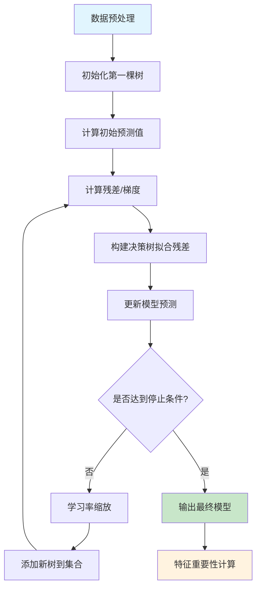
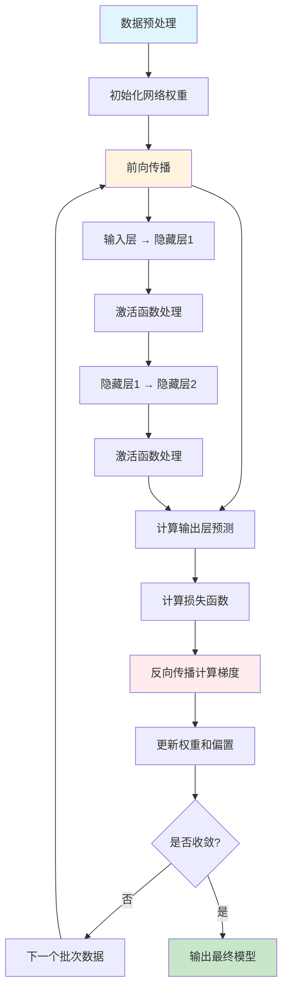
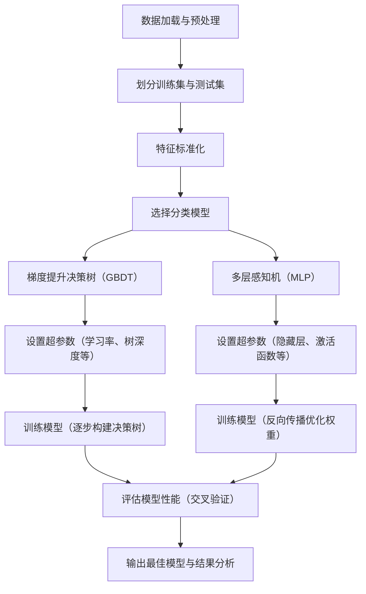

## 🎯 你的任务
根据细胞的**形态特征**（比如大小、形状、DNA分布等），预测这个细胞被什么**药物靶点**作用了。

你有**17种可能的药物靶点**（AMPA, CDK, Ca2, Cdc25...等）

---

## 模型一：GradientBoostingClassifier（梯度提升分类器）

### 🏗️ 工作原理（用简单比喻）

想象你在准备考试，有一个**学习小组**：

1. **第一个学生**先学习，做了一套题，得了60分
2. **第二个学生**看第一个学生的错误，重点学习那些错题，又做了一套题，得了70分
3. **第三个学生**看前两个学生都错的地方，专门补强，得了80分
4. ...这样继续下去，每个学生都专注于前面学生做错的地方
5. **最后**，把所有学生的答案综合起来，得到最终答案

**GradientBoosting就是这样工作的**：
- 它创建**很多个简单的"决策树"**（可以理解为简单的判断规则）
- 第一个树先做预测，找出错误
- 第二个树专门学习第一个树的错误
- 第三个树学习前两个树的错误
- ...这样一层层改进
- 最后把所有树的预测结果**加权平均**，得到最终答案

### 🌳 什么是决策树？
决策树就像**流程图**，通过一系列"是/否"问题来做决定：

```
例子：判断一个人是否喜欢看电影
├─ 年龄 > 25岁？
│  ├─ 是 → 喜欢动作片？
│  │  ├─ 是 → 预测：喜欢看电影
│  │  └─ 否 → 预测：不喜欢
│  └─ 否 → 喜欢动画片？
│     ├─ 是 → 预测：喜欢看电影
│     └─ 否 → 预测：不喜欢
```

### ✨ GradientBoosting的优点
- ✅ **准确率高**：通过不断改进错误，通常表现很好
- ✅ **能处理复杂关系**：可以发现特征之间的复杂组合
- ✅ **能看特征重要性**：告诉你哪些特征最重要（比如你的结果中`dist.30.nn`最重要）

### ⚠️ GradientBoosting的缺点
- ❌ **训练慢**：需要创建很多树，比较耗时
- ❌ **可能过拟合**：如果树太多，可能记住训练数据但泛化不好

### 📊 在你的项目中的表现
- **准确率：28.0%**
- 虽然看起来低，但比随机猜测（1/17 ≈ 5.9%）好很多
- 最重要的特征：`dist.30.nn`（第30个最近邻的距离）

---

## 模型二：MLPClassifier（多层感知器分类器，即神经网络）

### 🧠 工作原理（用大脑比喻）

想象**人脑的神经元网络**：

1. **输入层**：接收信息（比如你看到的细胞特征）
2. **隐藏层**：处理信息（大脑思考的过程）
3. **输出层**：给出答案（判断是什么药物靶点）

```
输入层（117个特征） → 隐藏层（100个神经元） → 输出层（17个类别）

细胞特征1 ─┐
细胞特征2 ─┤
细胞特征3 ─┼→ [隐藏层处理] → 预测：AMPA
  ...      │
细胞特征117─┘
```

### 🔢 具体工作过程

1. **输入**：每个细胞有117个特征（经过PCA降维后变成20个）
2. **加权求和**：每个特征乘以一个"权重"（权重是模型学习出来的）
3. **激活函数**：对结果进行非线性变换（让模型能学习复杂模式）
4. **输出**：得到17个数字，每个数字代表该类别是答案的概率
5. **选择**：概率最大的类别就是预测结果

### 🎓 学习过程（反向传播）

就像学生做错题后，老师告诉他哪里错了：

1. **前向传播**：数据从输入到输出，得到预测
2. **计算误差**：比较预测和真实答案的差距
3. **反向传播**：把误差传回去，调整每个权重
4. **重复**：不断调整，直到误差最小

### ✨ 神经网络的优点
- ✅ **强大的学习能力**：可以学习非常复杂的模式
- ✅ **自动特征组合**：能自动发现特征之间的复杂关系
- ✅ **适合大数据**：数据越多，通常表现越好

### ⚠️ 神经网络的缺点
- ❌ **黑盒模型**：很难解释为什么做出某个预测
- ❌ **需要调参**：隐藏层大小、学习率等参数需要仔细调整
- ❌ **可能过拟合**：如果网络太复杂，可能记住训练数据但泛化不好

### 📊 在你的项目中的表现
- **准确率：27.7%**（使用PCA降维后）
- 隐藏层：100个神经元
- 训练迭代：500次

---

## 🔄 两种模型的对比

| 特性 | GradientBoosting | MLP（神经网络） |
|------|------------------|----------------|
| **工作原理** | 多个决策树逐步改进 | 模拟大脑神经元网络 |
| **训练速度** | 较慢 | 中等 |
| **可解释性** | 较好（能看到特征重要性） | 较差（黑盒） |
| **处理复杂关系** | 很好 | 非常好 |
| **你的准确率** | 28.0% | 27.7% |

---

## GBDT训练过程详细思维导图


## MLP训练过程详细思维导图


---

## 🤔 为什么准确率这么低？

### 可能的原因：

1. **类别不平衡**：
   - 有些类别样本很多（如dopaminereceptor: 5133个）
   - 有些类别样本很少（如Cdc25: 692个）
   - 模型倾向于预测样本多的类别

2. **特征可能不够**：
   - 虽然有很多特征，但可能缺少关键信息
   - PCA降维可能丢失了一些重要信息

3. **模型参数未优化**：
   - 两个模型都使用默认参数
   - 没有进行超参数调优

4. **任务本身困难**：
   - 17个类别，随机猜测只有5.9%
   - 28%已经比随机好很多了

---

## 💡 改进建议

1. **处理类别不平衡**：
   - 使用SMOTE过采样（增加少数类样本）
   - 使用class_weight平衡各类别权重

2. **特征工程**：
   - 尝试不同的特征选择方法
   - 尝试不同的PCA主成分数量

3. **模型调优**：
   - 调整GradientBoosting的树的数量、深度
   - 调整MLP的隐藏层大小、学习率

4. **尝试其他模型**：
   - Random Forest（随机森林）
   - XGBoost（更强大的梯度提升）
   - SVM（支持向量机）

---

## 📝 总结

- **GradientBoosting**：像学习小组，逐步改进错误，可解释性好
- **MLP**：像大脑神经网络，学习能力强，但难以解释
- 两种模型在你的任务上表现相似（约28%准确率）
- 还有很大改进空间，特别是处理类别不平衡问题

### 模型训练具体步骤思维导图


